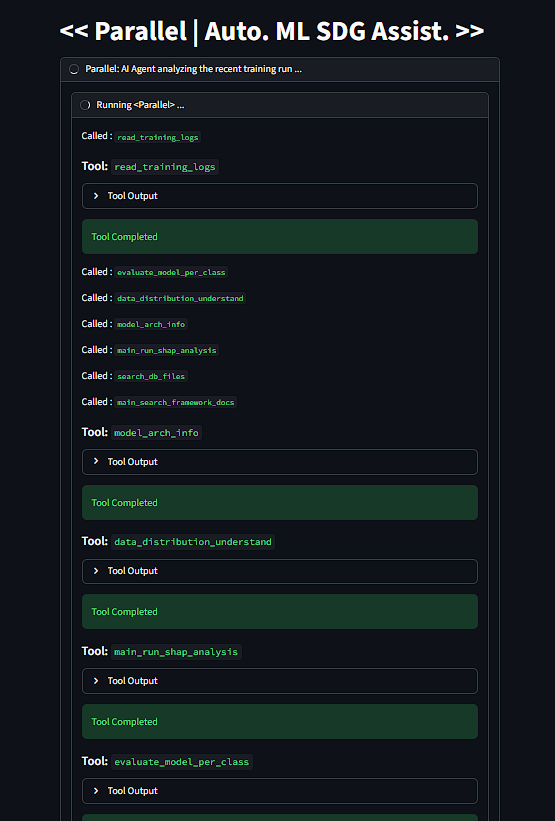
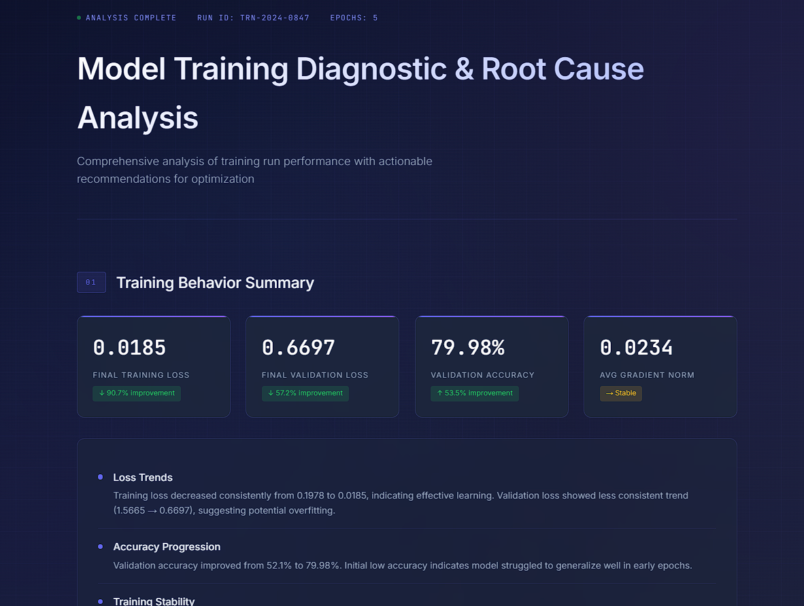

# << Parallel × Ara >>

### Autonomous Root Cause Analysis for ML Training Systems

---

## Overview

**Parallel × Ara** is an agentic debugging system for machine learning pipelines that performs **real time monitoring, root cause analysis (RCA), and automated incident reporting**.

It transforms ML debugging from a manual process into a **continuous, stateful, and autonomous workflow**.

* **Ara** handles persistent monitoring and failure detection
* **Parallel** executes structured, multi-agent debugging workflows

---

## What’s New

### Stateful Monitoring with LLM Memory

Ara now uses **LLM state caching** to retain and retrieve historical training context, enabling:

* Context-aware failure detection
* Improved decision making using past incidents
* Temporal reasoning across training steps

---

### Automated Incident Reporting Pipeline

Failures are now automatically:

* Summarized using LLMs
* Sent to **Twilio WhatsApp API** for real-time alerts
* Published as structured reports through **Ara** text-to-website interface

Example report:
[https://model-training-diagnosti.ara.so/](https://model-training-diagnosti.ara.so/)

---

<p align="center">
  
  
</p>

---

## Core Idea

Traditional ML debugging is reactive and manual.

Parallel × Ara introduces an **autonomous debugging pipeline**:

```text
Training Runs
        ↓
Ara Monitors + State Cache
        ↓
Failure Detected
        ↓
Parallel Agents Triggered
        ↓
Root Cause Analysis (RCA)
        ↓
Fix Suggested
        ↓
Report Generated
        ↓
WhatsApp Alert + Ara Report
        ↓
Incident Stored (Memory)
```

---

## System Architecture

Parallel is built using **LangGraph** for orchestrating modular diagnostic agents.

### Ara (Monitoring Layer)

* Continuous training monitoring
* Trigger detection (NaN loss, divergence, instability)
* Runtime scheduling
* LLM state caching for contextual awareness

### Parallel (Reasoning Layer)

* Multi-agent RCA workflows
* Tool-based diagnostics
* Structured reasoning pipelines
* Failure memory via FAISS

---

## Diagnostic Toolkit

Parallel includes specialized tools for:

* Log analysis
* Data distribution inspection
* Feature importance analysis
* Model architecture validation
* Historical incident retrieval (FAISS)

---

## Example Trigger

```json
{
  "epoch": 17,
  "is_trigger": true,
  "trigger_reason": "Loss became NaN"
}
```

This automatically initiates:

1. Multi-agent RCA
2. Root cause identification
3. Fix recommendation
4. Report generation and delivery

---

## LLM State Caching (Local)

locally maintain a structured memory of training state exposed through API (/llm_cache):

```python
{
    "utc_timestamp": str,
    "epoch": int,
    "train_loss": float,
    "is_trigger": bool,
    "trigger_reason": str,
    "updated_state_summary": str
}
```
We additonally expose prior-run-context info through API (/prior_context) 

```python
{
    "prior_context": str,
}
```

---

## Automated Reporting

### WhatsApp Alerts

* Real-time failure summaries sent via **Twilio**
* Concise RCA + suggested fixes

### Ara Reports

* Full structured incident reports
* Hosted automatically on **Ara**
* Includes logs, RCA reasoning, and recommendations

---

## Running Parallel (Standalone)

```bash
python runner.py \
  --train_file_path=... \
  --stream_file_path=...
```

---

## Running Parallel × Ara

### 1. Start Training

```bash
python models/sample_train_2.py
```

### 2. Start Monitoring API

```bash
python agent/ara_agents/monitor.py
```

### 3. Expose API

```bash
ngrok http <PORT>
```

Parallel will automatically trigger when failures are detected.

---

## Key Capabilities

* Continuous training monitoring
* Stateful failure detection (LLM memory)
* Automated root cause analysis
* Multi-agent debugging workflows
* Experience-based failure memory
* Real-time WhatsApp alerts
* Automated report generation
* Modular and extensible architecture

---

## Future Work

* Inference-time monitoring
* Concept drift detection
* Automated retraining loops
* Self-healing pipelines
* RCA visualization dashboards

---

## License

MIT License

---